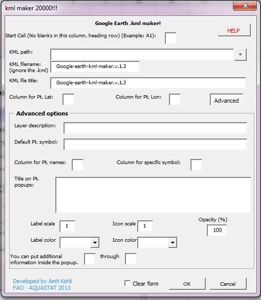
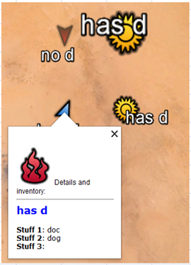

kml.maker.from.excel
====================

### Motivation/problem statement
##I have data and coordinates in an excel table, and I'd like to plot it, but:
* My GIS sucks/I don't know GIS
* I want to have lots of control over the map
* I don't want to use one of those sketchy web-services.

### :. Project purpose:
Make two types of google earth maps (kml files) right from Excel: Fast and easy, or detailed and complex (including metadata popups and advanced formatting). The detailed form looks like this:

And this is the complexity the script allows for (not that I recommend you make a map like that... "I'm just saying it comes with it"):

### Features:
* Simple and advanced modes
* uses a Userform for convenience
* Icons in the map change when highlighted
* Allows html to be passed to popup contents, everything is customizable
* Issue a default icon, and change icons for specific points
* Change colours and opacity for points via easy dropdowns
* Pass data from excel columns to the popup for each point 

### Demo:
Check out [a DEMO file with the form embedded](Demo v.1.0.xlsm), and some examples and showcasing the features so you know how to do it. 

### Installation
There's two ways to make it do the thing it does:

* Easiest way: Just download [THIS](Blank_template_with_stuff.xlsm) excel file. It has everything you need all ready to go. Just copy-paste your data into one of the sheets, push teh button, and go to town! Check out the first tab for help. If I missed something, let me know!
* More advanced: you can download the Userform [HERE](KML_maker.frm) and [HERE](KML_maker.frx) (download both in the same folder), and the macro that calls the userform [HERE](show_form.bas). Once downloaded:
 1. Open the Excel file where u wanna insert the form
 2. Go to your VB Explorer and import the form and the macro
 3. To bring up the form, either Create a button on your sheet that runs the macro to call the form (see demo), or run the macro directly
 
 
### Usage:

##### What it needs to make a map:
  * Names for each point
  * Data
  * Coordinates (2 columns: Lat/Long in decimal)
  * Information should be in Table (Wide) format so that each metadata heading is it's own column. See demo
  ** If your data is in List/Long//Tidy format, you'll need to switch it. Eventually I'll be uploading my dimension-changer too.

### Please provide comments and/or pull requests!
